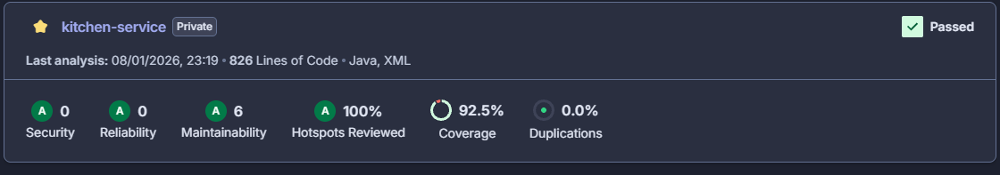
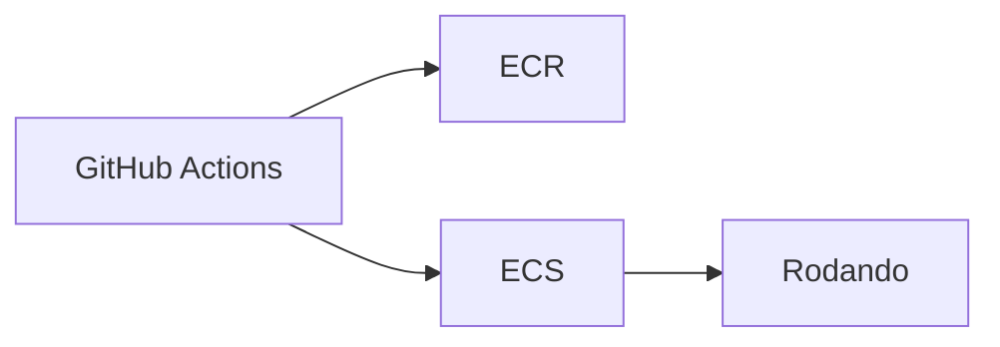

# SnackApp — Kitchen Service

Microserviço responsável por **processar pedidos da cozinha**, consumindo mensagens via **RabbitMQ**, persistindo estado no **DynamoDB**, e expondo APIs para atualização e consulta da fila de preparo.

---

## 🚀 Status

[](https://github.com/Pos-Tech-FIAP-Group/SnackOrderApp-kitchen-service/actions/workflows/pipeline.yml)


---

## 🧩 Arquitetura

A solução segue **Clean Architecture + Hexagonal**, desacoplando:

- **Domínio**
- **Use Cases**
- **Adapters (HTTP, AMQP, DynamoDB)**
- **Infra**


---

## 🧱 Modelagem de Dados (DynamoDB)

Tabela:

```
kitchen_orders
```

Chaves:

| Tipo | Campo |
|---|---|
| PK | `orderId (N)` |
| GSI | `status (S)` + `createdAt (S)` |

Exemplo de item:

```json
{
  "orderId": 1,
  "status": "EM_PREPARACAO",
  "createdAt": "2026-01-08T19:45:00Z",
  "itens": [
    {
      "name": "X-Salada",
      "quantity": 2,
      "addOns": [{ "name": "Cheddar", "quantity": 1 }]
    }
  ]
}
```

---

## 📥 Integração via RabbitMQ

### Fila

```
order-received-queue
```

### Payload

```json
{
  "orderId": 1,
   "itens": [
    {
      "name": "X-Salada",
      "quantity": 2,
      "addOns": [{ "name": "Cheddar", "quantity": 1 }]
    }
  ]
}
```


---

## 🌐 API HTTP

Base path:

```
/kitchen/orders
```

### **GET /kitchen/orders?status={status}**

Retorna a fila da cozinha.

**Exemplo:**

```
GET /kitchen/orders?status=RECEBIDO
```

### **PATCH /kitchen/orders/{orderId}/status**

Atualiza o status:

Estados possíveis:

```
RECEBIDO -> EM_PREPARACAO -> PRONTO -> FINALIZADO
```

Payload:

```json
{ "status": "EM_PREPARACAO" }
```

---

## 🧪 Testes Automatizados

Suportamos dois níveis:

### ✔ Unitários (JUnit5)

Cobrem:

- Domínio
- Use cases

### ✔ Coverage Sonar



### ✔ BDD (Cucumber + Testcontainers)

Simula fluxo real:

- Sobe RabbitMQ Testcontainer
- Sobe DynamoDB Local
- Publica mensagens
- Consulta API

Feature exemplo:

```gherkin
Scenario: Receber pedido e atualizar status
  Given que a infraestrutura Rabbit e Dynamo está disponível
  And que a tabela "kitchen_orders" existe no Dynamo
  When publico um pedido na fila com orderId 1 e 2 itens
  Then o pedido "1" deve aparecer na consulta por status "RECEBIDO"
  When atualizo o status do pedido "1" para "EM_PREPARACAO"
  Then o pedido "1" deve estar com status "EM_PREPARACAO"
```

---

## ⚙ Execução Local

### 1. Subir infraestrutura

```sh
docker compose up -d
```

Isso sobe:

✔ RabbitMQ  
✔ DynamoDB Local

### 2. Rodar aplicação

```sh
mvn spring-boot:run -Dspring.profiles.active=local
```

---

## 🌩 Deploy na AWS

### Padrão usado:

✔ **ECS Fargate (serverless)**  
✔ **ECR como registry**  
✔ **DynamoDB Serverless**  
✔ **RabbitMQ**

Recursos:

| Recurso | Valor |
|---|---|
| Cluster | `snackapp-kitchen-cluster` |
| Service | `kitchen-service` |
| ECR repo | `snackapp-kitchen-service` |
| Runtime | **Java 21** |
| Deployment | **Rolling** |

Pipeline CD:



---

## 📂 Estrutura do Projeto

```txt
src
 ├── core
 │   ├── domain
 │   ├── application
 │   └── ports
 ├── adapters
 │   ├── driver (HTTP + AMQP)
 │   └── driven (DynamoDB)
 └── bdd
```

---

## 📦 Dependências Chave

- Spring Boot 3
- Java 21
- RabbitMQ
- AWS DynamoDB Enhanced Client
- Testcontainers
- Cucumber
- Lombok

---

## 🔐 Configuração

Ambientes:

| Ambiente | Profile | Endpoint Dynamo |
|---|---|---|
| Local | `local` | `http://localhost:8000` |
| Testes | `test` | definido em Testcontainers |
| Produção | `prod` | AWS DynamoDB |
| ECS | `prod` | IAM Role |

---
